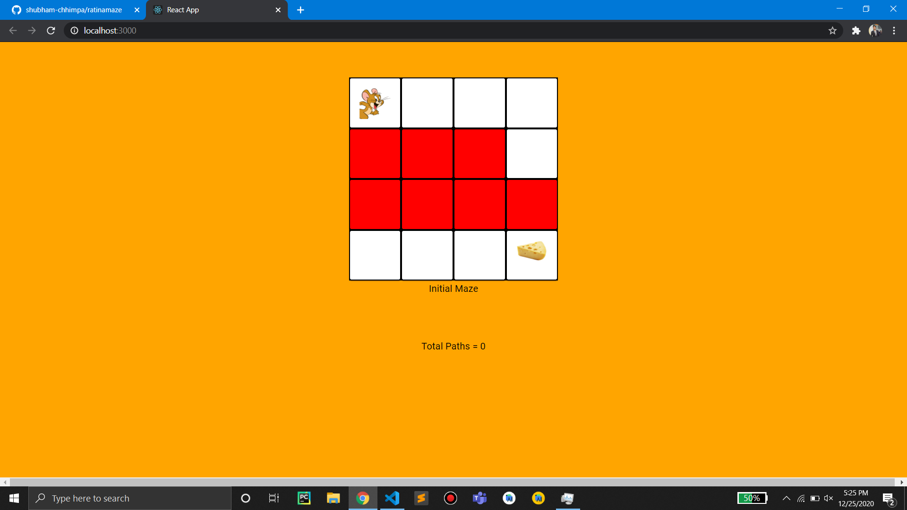
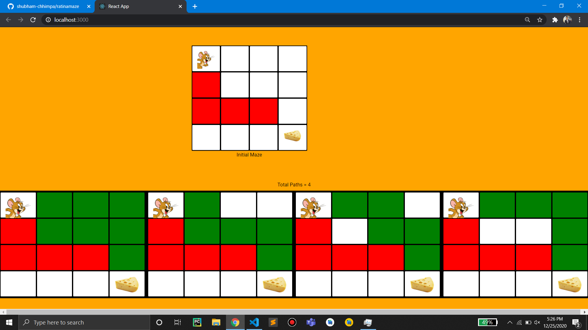

# Rat in a maze

- Currently I am learning recursion and backtracking. So there is a famous backtracking question called "Rat in a Maze" , I thought of visualizing it.

- So I created a simple web app that shows all the path from top left to bottom right for a maze with obstacles.

- The constraints are :
1. Rat can't go outside the maze
2. Rat can't pass through the red cell
3. Rat can go 1 step (up, down, right, left) at a time.

- The app is built with ReactJs.

## Screenshots

## Development
### How to <i>Setup</i>
 - `cd ratinamaze`
 - `npm install`

 
### How to <i>RUN</i>
#### Web App
 - `npm start`
 - Go to http://127.0.0.1:3000/
